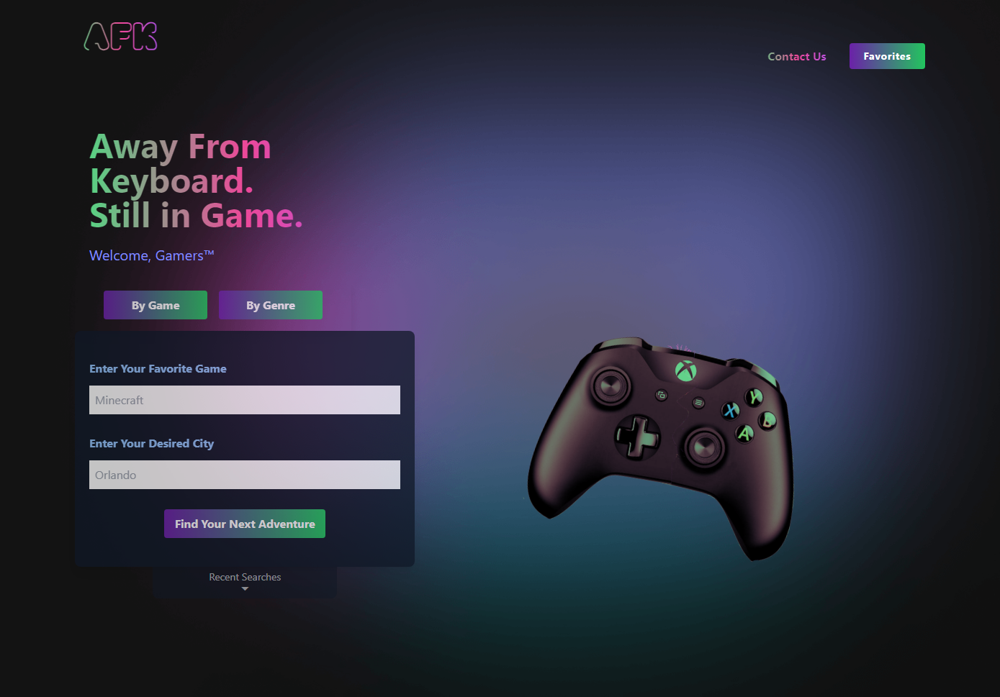
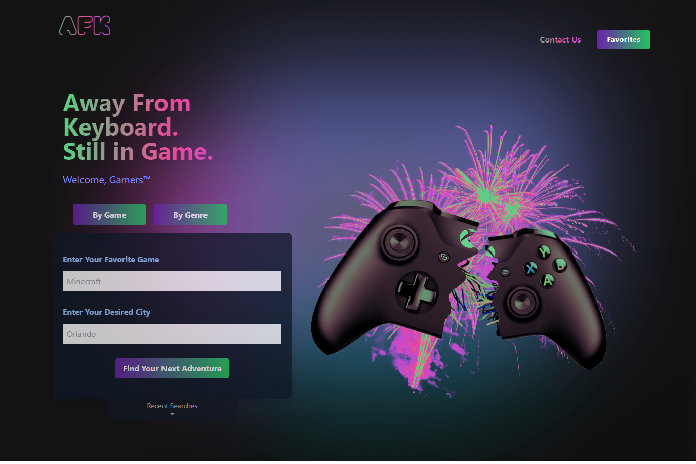

# AFK

Step away from your keyboard, but still be in game!

## Usage

1. Input one of your favorite games, or choose any of the following genres:

- Shooter
- Platform
- Racing
- RPG
- Sports
- Adventure
- Arcade
- Horror

2. Enter the location where you would like to search. (ex. Orlando, NYC)
3. Click the search button to get dozens of personalized places for your next adventure.

See information about the business, get directions, visit the Yelp page, even save it to your favorites.

Visit the live site [here](https://jlausier.github.io/AFK-Coop/)

## Technologies

We used [excalidraw](https://excalidraw.com/#room=38a29e77ac5b3026aa0f,qWynBzUBf2m8wvpcgPZITA) to do our mock-up and wireframing

### Front End

- Tailwind CSS
- jQuery
- Google Fonts

### APIs

- IGDB API
- Yelp Fusion API

## Screenshots

