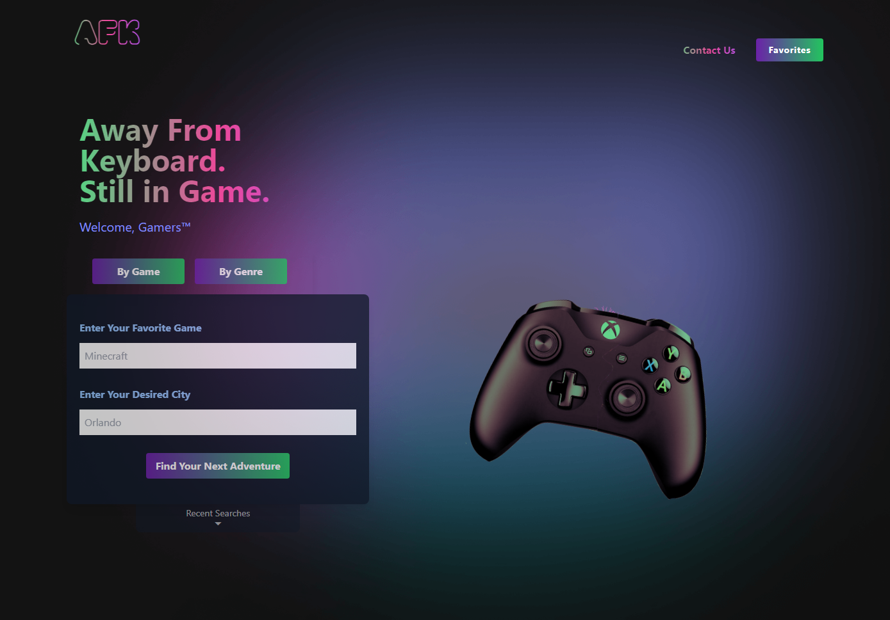

# AFK

Step away from your keyboard, but still be in game!

## Usage

1. Input one of your favorite games, or choose any of the following genres:

- Shooter
- Platform
- Racing
- RPG
- Sports
- Adventure
- Arcade
- Horror

2. Enter the location where you would like to search. (ex. Orlando, NYC)
3. Click the search button to get dozens of personalized places for your next adventure.

See information about the business, get directions, visit the Yelp page, even save it to your favorites.

Visit the live site [here](https://jlausier.github.io/AFK-Coop/)

## Technologies

We used [excalidraw](https://excalidraw.com/#room=38a29e77ac5b3026aa0f,qWynBzUBf2m8wvpcgPZITA) to do our mock-up and wireframing

### Front End

- Tailwind CSS
- jQuery
- Google Fonts

### APIs

- IGDB API
- Yelp Fusion API

## Deployment

The app is an **Express.js + static frontend** stack. Deploy to any Node.js host (Render, Railway, Fly.io, etc.).

### Required environment variables

Add these in your host’s dashboard:

| Variable | Description |
|----------|-------------|
| `YELP_API_KEY` | Yelp Fusion API key |
| `IGDB_CLIENT_ID` | IGDB/Twitch client ID |
| `IGDB_CLIENT_SECRET` | IGDB/Twitch client secret |

Copy `.env.example` to `.env` locally and fill in your keys.

### Deploy on Render

1. Push your repo to GitHub.
2. Go to [render.com](https://render.com) → New → Web Service.
3. Connect your repo and use these settings:
   - **Build command:** `npm install`
   - **Start command:** `npm start`
   - Add env vars under Environment.
4. Deploy.

### Deploy on Railway

1. Push your repo to GitHub.
2. Go to [railway.app](https://railway.app) → New Project → Deploy from GitHub.
3. Add the env vars above in Project → Variables.
4. Railway will detect Node.js and use `npm start`.

### Deploy on Fly.io

```bash
fly launch   # Follow prompts
fly secrets set YELP_API_KEY=xxx IGDB_CLIENT_ID=xxx IGDB_CLIENT_SECRET=xxx
fly deploy
```

---

## Screenshots




